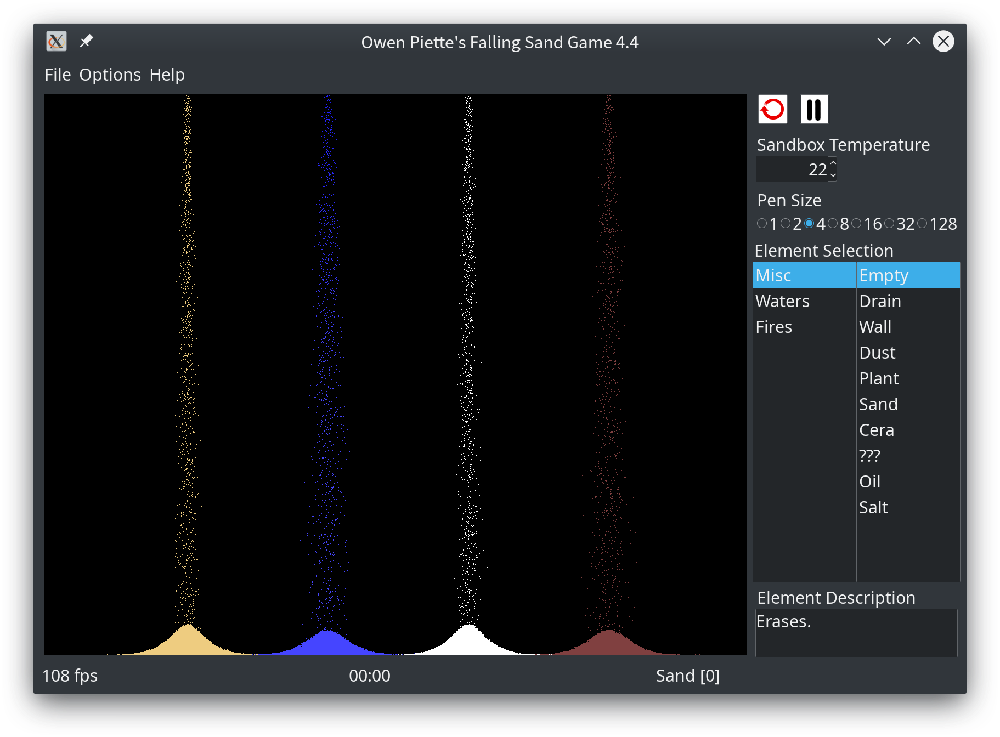

# wxSand - Owen Piette's Falling Sand Game

As a kid, I spent many hours in the school library playing this game, and I
compiled the Linux version as well. I tried finding it again, but it looks like
the original author has [abandoned it](http://www.piettes.com/fallingsandgame/)
as his site now only links to the Windows version.

This repository contains the Linux source code he distributed, as well as a
patched version by me to make it compile under modern versions of wxWidgets.

This software was last updated by its original author in 2006, and is
abandonware. The forum about it, fallingsandgame.com, has been down now for many
months with a MySQL error, so all mods seem to be lost. (If you have any others,
open issues and I'll add them to the mods/ directory.)

It's fun abandonware though, and works well on modern platforms. Actually, I 
think it works better on modern platforms than it ever did in 2006 -- on my 
system, which has an i7-6700, it is impossible to get it to run slower than 
15fps with the default mod, and that's with the entire screen full of sand. With
the "Sources" on and "Limit FPS" off, the game runs at well over 200 FPS, 
reaching 256 FPS. This performance would have been incredible when this game was 
in active development...we can thank Moore's law for that.

## Compilation howto:

Compilation should be as simple as:

    cd fsg-4.4
    make

Make sure you have wxWidgets and an appropriate C++ compiler installed. The
compiled binary will be output in the current directory and be named `wxsand`.
